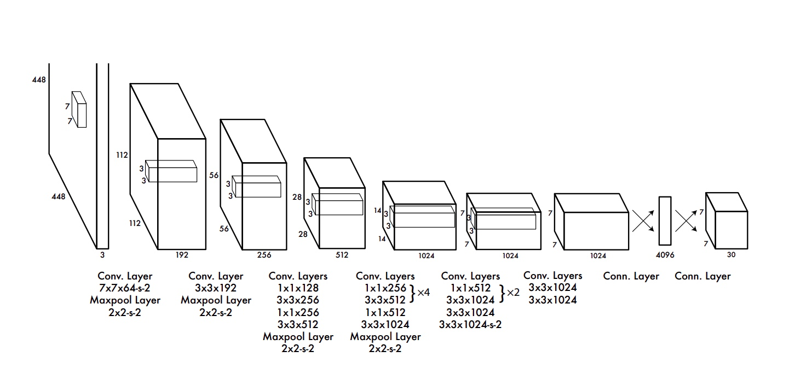

# analog_detector
Репозиторий посвещен разработанной на чемпионате REASkills 2025 системе определения показаний на аналоговых приборах

# Quick Start
* Клонируйте репозиторий `git clone https://github.com/Cooperos/analog_detector`
* Скачайте данные для обучения в директорию Images *тут должна быть ссылка*
* Запустите `my_dag_airflow.py` для обучения модели и получения предсказаний

# Технологии репозитория
* YOLO Detect & YOLO Classificator (https://docs.ultralytics.com/ru/models/)
* Tensorflow CNN (https://www.tensorflow.org/?hl=ru)

# Принцип работы системы
Работа системы делится на этапы:
1. Загрузка изображений
2. Аугментация изображений
3. Обучение модели классификации на изображениях
4. Предсказание на валидационной выборке
